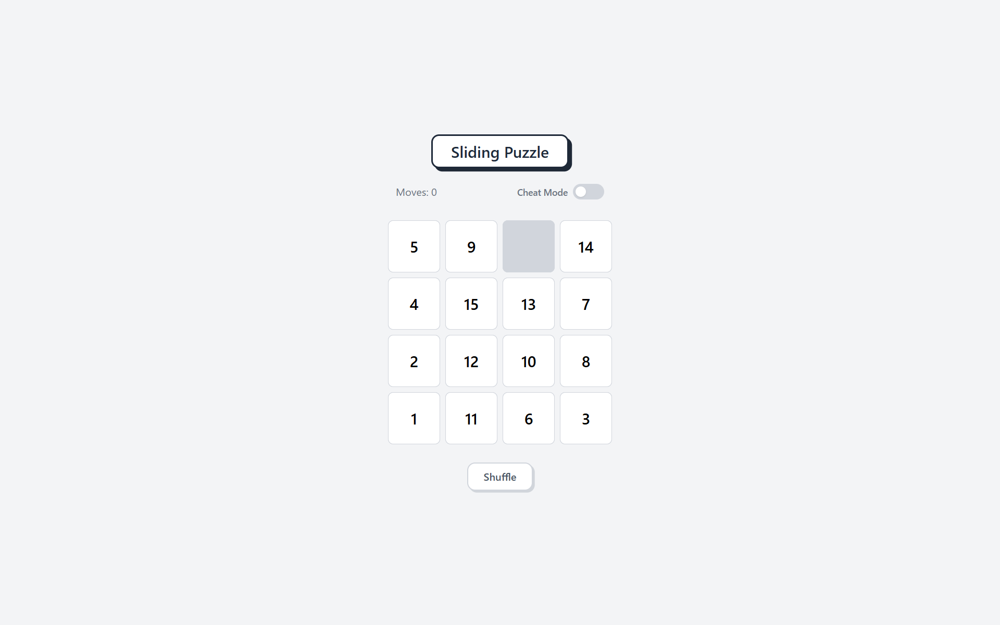

# Sliding Puzzle

A classic 15-tile sliding puzzle built with React and TypeScript.

🔗 **[Live Demo](https://sliding-puzzle-swart-delta.vercel.app)**



## How to Play

Slide the numbered tiles into the correct order (1-15) with the empty space in the bottom right corner. Click any tile adjacent to the empty space to move it.

## Features

- Click to move adjacent tiles
- Move counter
- Shuffle button for a new game
- Cheat mode with drag and drop — move any tile anywhere
- Win animation with ripple effect
- Solvability check — every shuffle is guaranteed to be solvable

## Tech Stack

- React
- TypeScript
- Tailwind CSS
- Vite
- dnd-kit

## Getting Started
```bash
git clone https://github.com/Koji1999/sliding-puzzle
cd sliding-puzzle
npm install
npm run dev
```

Open [http://localhost:5173](http://localhost:5173) in your browser.